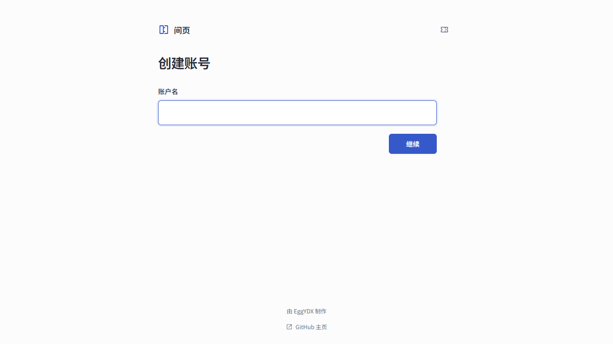

#  间页 · JianyeGame

[简体中文](README.md)

**[Play](https://eggydx.github.io/JianyeGame/)**

<p align="center">
  
</p>

You came to Jianye to make an account.

You've picked a username. All that's left is a password.

You type something you'll remember and press Continue. One small correction. Fair enough.

That does it.

Except another line has appeared.

You add a few characters. Move a few around. Something that was fine a moment ago turns red.

Perhaps this website is just fussy.

After a few more edits, the password barely looks like the one you started with. The Continue button hasn't moved. You're less sure where it's taking you.

Might as well finish signing up.

## What you're playing

- One password has to satisfy **a growing list of requirements**.
- Where you put a character can matter as much as what you add.
- Use the invitation code someone sent you and experience it for yourself!

## How to play

1. Choose a username.
2. Enter a password and press **继续** (Continue).
3. Adjust it to meet the requirements on the page.
4. Once everything passes, press Continue to finish signing up.

The rest is yours to find out.

## Run locally

You'll need Node.js 24+ and pnpm 11.

### Development

```bash
pnpm install --frozen-lockfile
pnpm dev
```

By default, the development page opens at `http://127.0.0.1:5173/dev.html`.

### GitHub Pages build

```bash
pnpm pages
```

The build goes into `dist/` and is also copied to `docs/`. Open `docs/index.html` to play locally.

## Built with

- React, TypeScript
- Vite, esbuild
- CSS, Web Animations API
- pure-rand, unicode-segmenter
- Vitest, fast-check, Playwright (tests)

## Project status

Playable from start to finish. Difficulty and phone controls still need more playtesting.

## License

Original code in this project is licensed under the [MIT License](LICENSE).

Third-party libraries, fonts, icons, and other dependencies may be subject to their own licenses and copyright notices. See [THIRD_PARTY_NOTICES.md](THIRD_PARTY_NOTICES.md) for details.
